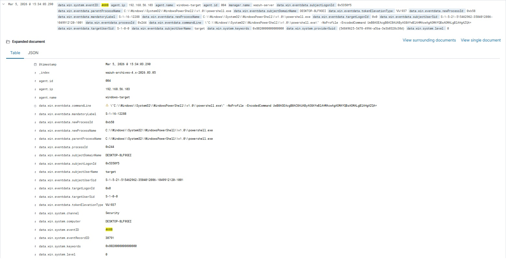
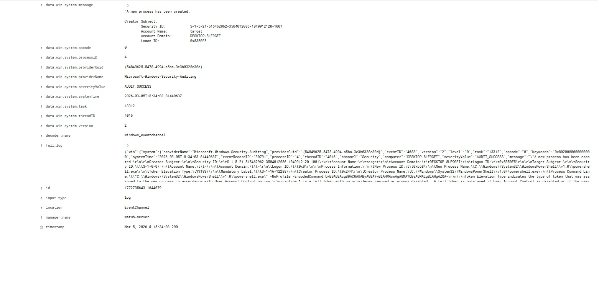
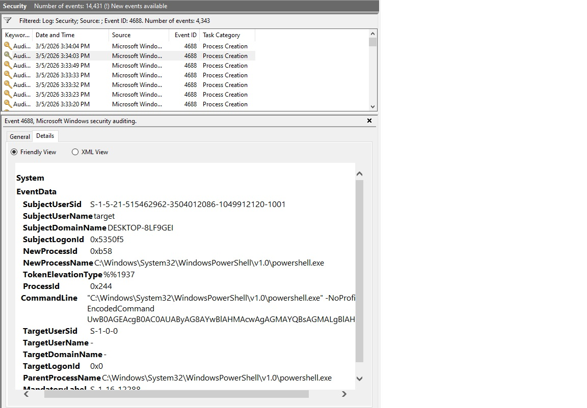

> [Back to SOC Portfolio](https://github.com/MoisesDaMata?tab=repositories)

---

# Detecting Suspicious PowerShell Execution — Encoded Command

> **Lab Type:** Threat Detection | **Platform:** Wazuh SIEM | **Difficulty:** Intermediate

---

## Objective

This lab demonstrates how a **Security Operations Center (SOC)** can detect suspicious PowerShell activity using Base64-encoded commands, a common attacker technique used to hide malicious payloads and bypass security controls.

We simulate a real-world attack scenario where a threat actor executes an encoded PowerShell command on a Windows target, and show how **Wazuh** detects the activity through **Windows Security Event Logs**.

---

## Prerequisites & Lab Setup

| Component  | Details                        |
|------------|-------------------------------|
| Hypervisor | VirtualBox / VMware            |
| Attacker   | Kali Linux VM                  |
| Target     | Windows 10 VM + Wazuh Agent    |
| SIEM       | Wazuh Server (separate VM)     |

**Windows Audit Policy configuration (required for Event ID 4688):**
```powershell
# Enable Process Creation auditing
auditpol /set /subcategory:"Process Creation" /success:enable /failure:enable

# Enable Command Line logging in Process Creation events
reg add "HKLM\Software\Microsoft\Windows\CurrentVersion\Policies\System\Audit" /v ProcessCreationIncludeCmdLine_Enabled /t REG_DWORD /d 1 /f
```

> Without Command Line logging enabled, Event ID 4688 will capture the process name but **not** the `-EncodedCommand` argument — making detection impossible.

---

## Lab Architecture
```
┌─────────────────┐        ┌──────────────────┐        ┌─────────────────────┐
│   Kali Linux    │ ──────▶│   Windows 10     │ ──────▶│    Wazuh SIEM       │
│   (Attacker)    │  RDP/  │   (Target)       │  Agent │  (Detection & Alert)│
│                 │  Shell │  Wazuh Agent     │  Logs  │                     │
└─────────────────┘        └──────────────────┘        └─────────────────────┘
```

| Component | Role              | OS / Tool    |
|-----------|-------------------|--------------|
| Attacker  | Executes payload  | Kali Linux   |
| Target    | Victim machine    | Windows 10   |
| SIEM      | Detection engine  | Wazuh Server |

---

## Attack Simulation

The attacker uses the `-EncodedCommand` flag to pass a **Base64-encoded payload** to PowerShell, a well-known Living-off-the-Land (LotL) technique.

**Command executed on the target:**
```powershell
powershell.exe -NoProfile -EncodedCommand UwB0AGEAcgB0AC0AUAByAG8AYwBlAHMAcwAgAGMAYQBsAGMALgBlAHgAZQA=
```

**Decoded payload:**
```powershell
Start-Process calc.exe
```

> For demonstration purposes, the payload executes `calc.exe` as a benign stand-in for a malicious process.

**Why attackers use encoded commands:**
- Bypass basic string-matching detection rules
- Obscure malicious intent from log reviewers
- Evade email and web gateway filters

---

## Detection — Wazuh Alert

Wazuh detects the activity by parsing **Windows Security Event ID 4688** (Process Creation), triggered when a new process is spawned with suspicious arguments.

### Wazuh — Expanded Document part.1


### Wazuh — Expanded Document part.2


### Alert Triggered
```
Rule ID    : 92025
Description: Suspicious PowerShell execution with EncodedCommand flag
Severity   : High
```

### Key Fields in the Alert

| Field          | Value                                                              |
|----------------|--------------------------------------------------------------------|
| Event ID       | `4688` — Process Creation                                          |
| Agent          | `windows-target` (192.168.56.103)                                  |
| User           | `target` @ `DESKTOP-8LF9GEI`                                       |
| Logon ID       | `0x5350f5`                                                         |
| Parent Process | `C:\Windows\System32\WindowsPowerShell\v1.0\powershell.exe`        |
| New Process    | `C:\Windows\System32\WindowsPowerShell\v1.0\powershell.exe`        |
| Process ID     | `0xb58`                                                            |
| Command Line   | `powershell.exe -NoProfile -EncodedCommand UwB0AGEAcgB0...`        |

---

## Log Analysis

During investigation, the SOC analyst reviews the raw Windows Security logs to confirm the chain of execution.

### Windows Event Viewer — Event ID 4688

```
Subject User    : target
Domain          : DESKTOP-8LF9GEI
Logon ID        : 0x5350f5
Parent Process  : C:\Windows\System32\WindowsPowerShell\v1.0\powershell.exe
New Process     : C:\Windows\System32\WindowsPowerShell\v1.0\powershell.exe
Process ID      : 0xb58
Command Line    : powershell.exe -NoProfile -EncodedCommand UwB0AGEAcgB0AC0AUAByAG8AYwBlAHMAcwAgAGMAYQBsAGMALgBlAHgAZQA=
```

> **Analyst Note:** PowerShell spawning child processes via encoded commands is a **high-confidence indicator** of post-exploitation or malware staging activity.

---

## Investigation Steps

Following the alert, the SOC analyst performed the investigation below using data extracted directly from the Wazuh alert and Windows Event Viewer.

1. **User account identified:** `target` on host `DESKTOP-8LF9GEI`, Logon ID `0x5350f5`
2. **Source host confirmed:** agent `windows-target` at IP `192.168.56.103`
3. **Payload decoded:** `Start-Process calc.exe` — benign in this scenario, but consistent with malware staging patterns
4. **Child process mapped:** `calc.exe` spawned by `powershell.exe` (PID `0xb58`)
5. **Event correlated:** single isolated execution, no additional suspicious events in the same timeframe
6. **Persistence check:** no scheduled tasks, registry run keys, or startup entries found related to this execution

---

## MITRE ATT&CK Mapping

| Field         | Value                                              |
|---------------|----------------------------------------------------|
| Tactic        | **Execution**                                      |
| Technique     | **T1059.001** — Command and Scripting: PowerShell  |
| Sub-technique | Obfuscated Command Execution via `-EncodedCommand` |

[View T1059.001 on MITRE ATT&CK](https://attack.mitre.org/techniques/T1059/001/)

---

## Response Actions

Upon confirming malicious activity, the following response actions are recommended:

- **Isolate** the affected host from the network immediately
- **Review** full PowerShell command history (`PSReadLine`, Script Block Logging)
- **Hunt** for persistence mechanisms on the host
- **Reset** credentials for the compromised user account
- **Run** a full malware scan and check for lateral movement indicators

---

## Lessons Learned

- Encoded PowerShell commands are a **staple of modern attacker tradecraft**, used in everything from commodity malware to APT campaigns.
- **Process creation logging (Event ID 4688)** alone is not sufficient — **Command Line logging must be explicitly enabled** to capture the `-EncodedCommand` argument.
- Wazuh's rule engine can effectively detect these patterns with properly configured Windows audit policies.
- Early detection of encoded PowerShell execution can **prevent full compromise** by catching attackers during the execution phase — before persistence is established.

---

## Tools & Technologies


---

## Connect
[](https://www.linkedin.com/in/moisesfpm/)

*Developed by Moises da Mata*
