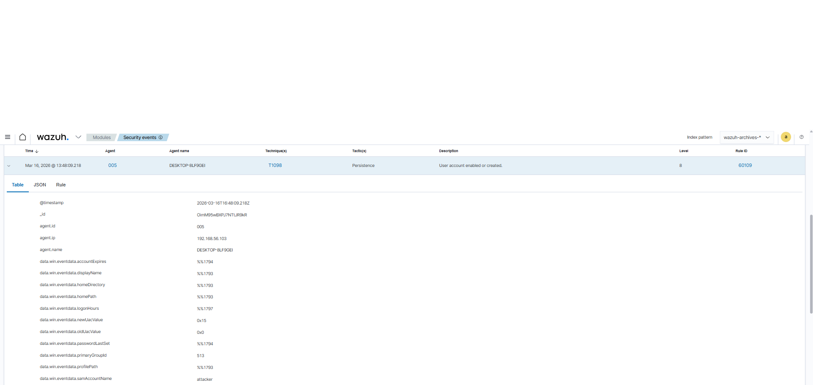
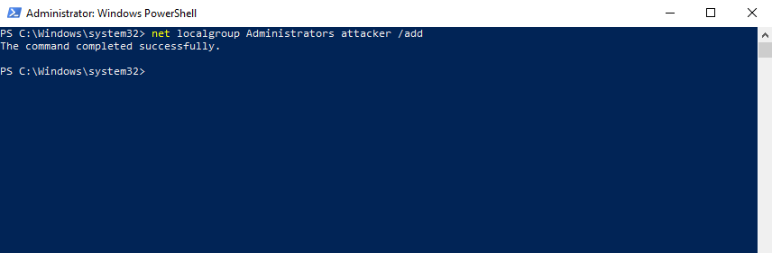
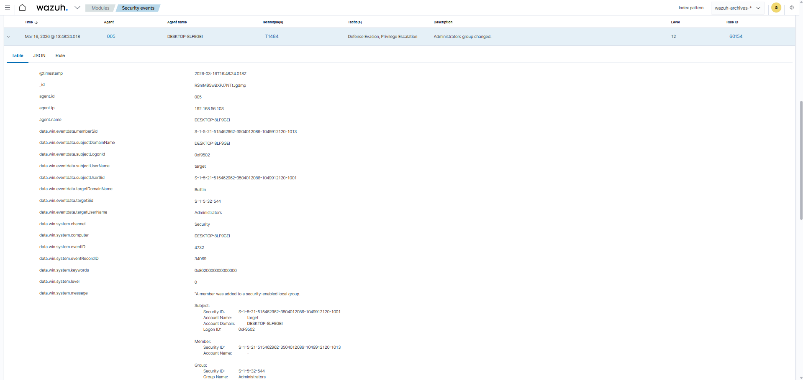

# Lab 05 — Privilege Escalation Detection (T1078)

## MITRE ATT&CK
- **Tactic:** Privilege Escalation
- **Technique:** T1078.003 — Valid Accounts: Local Accounts
- **Detection:** Windows Security Event IDs 4720, 4732

---

## Objective

Simulate a privilege escalation attack using a valid local account, a technique used by attackers to gain administrative access without exploiting vulnerabilities, and detect the behavior through Wazuh SIEM by monitoring Windows account management events.

---

## Lab Environment

| Machine | Role | IP |
|---|---|---|
| Windows 10 | Target | 192.168.56.103 |
| Wazuh Server | SIEM | — |

---

## Technical Background

Unlike exploit-based attacks, this technique abuses legitimate operating system functionality. The attacker creates a standard user account and immediately adds it to the local Administrators group — gaining maximum privileges without triggering exploit-based detections.

The two critical events generated are:
- **Event ID 4720** — new user account created
- **Event ID 4732** — account added to the local Administrators group

Correlating both events by the same SID confirms the privilege escalation.

---

## Attack Walkthrough

### 1. Create account and escalate privileges

On Windows 10, with `cmd.exe` opened as Administrator:

```powershell
# Create standard user
net user attacker Password123! /add

# Add to Administrators group
net localgroup Administrators attacker /add

# Confirm group membership
net localgroup Administrators
```



---

### 2. Confirm addition to Administrators group

```powershell
net localgroup Administrators
```



---

### 3. Detection in Wazuh — Event IDs 4720 and 4732

Wazuh captured both events in sequence:

**Event ID 4720 — Account created:**

| Field | Value |
|---|---|
| `eventID` | `4720` |
| `newTargetUserName` | `attacker` |
| `subjectUserName` | `target` |

**Event ID 4732 — Added to Administrators group:**

| Field | Value |
|---|---|
| `eventID` | `4732` |
| `memberSid` | SID matching the `attacker` account |
| `targetUserName` | `Administrators` |
| `subjectUserName` | `target` |



---

## SID Correlation Analysis

The key to confirming privilege escalation is correlating the SID across both events:

```
Event 4720 — Account Created
  User:  attacker
  SID:   S-1-5-21-...-XXXX

Event 4732 — Added to Administrators Group
  Member SID: S-1-5-21-...-XXXX

→ The matching SID confirms that the newly created account
  was immediately granted administrative privileges.
```

---

## Indicators of Compromise (IOCs)

| Indicator | Value |
|---|---|
| Event IDs | `4720`, `4732` |
| Account created | `attacker` |
| Target group | `Administrators` |
| Commands | `net user /add` + `net localgroup Administrators /add` |

---

## What the SOC Should Look For

- Event ID 4720 followed quickly by Event ID 4732 for the same SID
- Accounts added to the Administrators group outside business hours
- Account creation with generic or suspicious names
- `net.exe` used for group management by non-administrative users
- Event ID 4672 (special privileges) shortly after the new account logs in

---

## File Structure

```
lab-05-privilege-escalation-T1078/
├── README.md
└── images/
    ├── event_4720.png
    ├── administrator_group_addition.png
    └── event_4732.png
```

---

## References

- [MITRE ATT&CK T1078.003 — Valid Accounts: Local Accounts](https://attack.mitre.org/techniques/T1078/003/)
- [Windows Event ID 4720 — User Account Created](https://learn.microsoft.com/en-us/windows/security/threat-protection/auditing/event-4720)
- [Windows Event ID 4732 — Member Added to Security Group](https://learn.microsoft.com/en-us/windows/security/threat-protection/auditing/event-4732)
- [Wazuh Documentation](https://documentation.wazuh.com)
