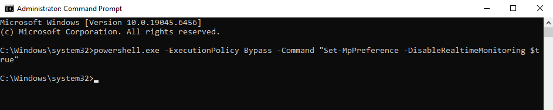
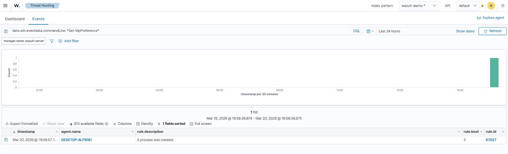
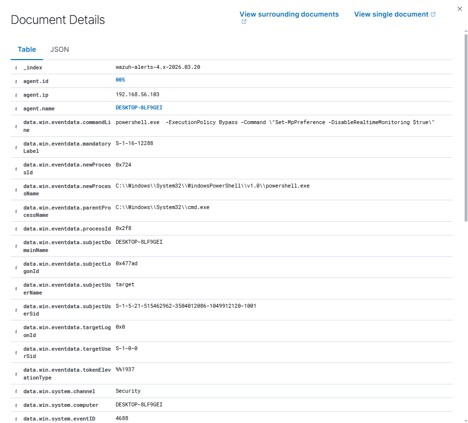

# Lab 08 — Disable Windows Defender Detection (T1562)

## MITRE ATT&CK
- **Tactic:** Defense Evasion
- **Technique:** T1562.001 — Impair Defenses: Disable or Modify Tools
- **Detection:** Windows Security Event ID 4688 (Process Creation)

---

## Objective

Simulate the disabling of Windows Defender via command line, a technique used by attackers to remove the primary endpoint protection layer before executing malicious tools or payloads, and detect the behavior through Wazuh SIEM.

---

## Lab Environment

| Machine | Role | IP |
|---|---|---|
| Windows 10 | Target | 192.168.56.103 |
| Wazuh Server | SIEM | — |

---

## Technical Background

Before executing offensive tools on a compromised system, attackers frequently disable or modify security solutions to avoid detection. Disabling Windows Defender via `Set-MpPreference` is one of the most documented and widely used techniques by malware, ransomware, and APT groups.

In this lab, the attacker:
1. Opens `cmd.exe` with Administrator privileges
2. Explicitly calls `powershell.exe` as a child process, passing the disable command via `-Command`
3. Wazuh captures Event ID 4688 with the full `commandLine`, exposing the evasion attempt

The choice to invoke PowerShell from `cmd.exe` is intentional — it ensures the creation of a new child process, generating event 4688 with the full execution chain visible: parent process (`cmd.exe`) → child process (`powershell.exe`) → argument (`Set-MpPreference -DisableRealtimeMonitoring $true`).

---

## Attack Walkthrough

### 1. Disable Windows Defender via cmd.exe

On Windows 10, with `cmd.exe` opened as Administrator:

```cmd
powershell.exe -ExecutionPolicy Bypass -Command "Set-MpPreference -DisableRealtimeMonitoring $true"
```

The command returns without error — Defender is disabled.



---

### 2. Detection in Wazuh — Event ID 4688

In the Wazuh Dashboard, the event was located using the filter:

```
data.win.eventdata.commandLine: *Set-MpPreference*
```

Wazuh returned **1 hit** — the `powershell.exe` process launched by `cmd.exe` on agent `DESKTOP-8LF9GEI`, rule ID `67027`, at `Mar 20, 2026 @ 19:56:57`.



---

### 3. Event field analysis

With the event expanded in Wazuh, the fields confirm the full execution chain:

| Field | Value |
|---|---|
| `eventID` | `4688` |
| `newProcessName` | `C:\Windows\System32\WindowsPowerShell\v1.0\powershell.exe` |
| `parentProcessName` | `C:\Windows\System32\cmd.exe` |
| `commandLine` | `powershell.exe -ExecutionPolicy Bypass -Command "Set-MpPreference -DisableRealtimeMonitoring $true"` |
| `subjectUserName` | `target` |
| `subjectDomainName` | `DESKTOP-8LF9GEI` |



---

## Indicators of Compromise (IOCs)

| Indicator | Value |
|---|---|
| Process | `powershell.exe` |
| Parent process | `cmd.exe` |
| Command | `Set-MpPreference -DisableRealtimeMonitoring $true` |
| Suspicious flag | `-ExecutionPolicy Bypass` |
| Event ID | `4688` |

---

## What the SOC Should Look For

- `powershell.exe` launched from `cmd.exe` with `-ExecutionPolicy Bypass`
- `commandLine` containing `Set-MpPreference` combined with `-Disable*`
- Any modification to Defender preferences via command line
- Child processes of `cmd.exe` or `powershell.exe` executing security cmdlets
- Suspicious sequence: Defender disabled followed by download or new process execution

---

## Cleanup

```cmd
powershell.exe -ExecutionPolicy Bypass -Command "Set-MpPreference -DisableRealtimeMonitoring $false"
```

---

## File Structure

```
lab-08-disable-defender-T1562/
├── README.md
└── images/
    ├── 01-defender-disabled.png
    ├── 02-wazuh-4688-defender.png
    └── 03-wazuh-event-details.png
```

---

## References

- [MITRE ATT&CK T1562.001 — Impair Defenses](https://attack.mitre.org/techniques/T1562/001/)
- [Windows Event ID 4688 — Process Creation](https://learn.microsoft.com/en-us/windows/security/threat-protection/auditing/event-4688)
- [Wazuh Documentation](https://documentation.wazuh.com)
